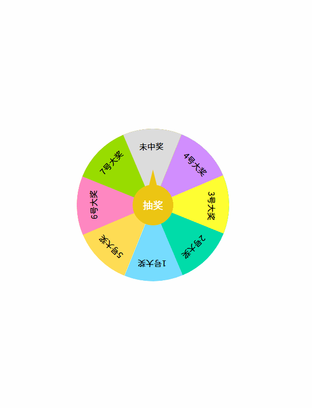

# 大转盘抽奖系统 (Lucky Wheel Prize System)

一个基于 HTML5、CSS3 和 JavaScript 实现的精美大转盘抽奖系统，支持自定义奖项和概率设置。

## 功能特点

- 🎯 流畅的旋转动画效果
- 🎨 精美的视觉设计
- ⚙️ 可自定义奖项内容
- 📊 支持概率权重设置
- 🎮 简单易用的交互界面
- 📱 响应式设计，适配各种设备

## 在线演示



## 安装说明

1. 克隆项目到本地：
```bash
git clone https://github.com/ch-repository/lucky-wheel.git
```

2. 直接打开 `index.html` 文件即可运行

## 使用说明

1. 点击转盘中心的"抽奖"按钮开始抽奖
2. 转盘会旋转并最终停在随机奖项位置
3. 等待转盘停止后即可看到中奖结果

## 自定义配置

### 修改奖项内容

在 `index.html` 文件中找到 `texts` 数组，修改其中的奖项名称：

```javascript
let texts = [
    "1号大奖",
    "2号大奖",
    "3号大奖",
    "4号大奖",
    "5号大奖",
    "6号大奖",
    "7号大奖",
    "未中奖"
];
```

### 调整中奖概率

在 `index.html` 文件中找到 `weight` 数组，修改其中的权重值：

```javascript
let weight = [1, 5, 10, 15, 22, 30, 40, 100];
```

数值越大，中奖概率越高。

### 修改转盘颜色

在 CSS 部分找到对应的颜色代码进行修改：

```css
.left div.one {
    background-color: #77DDFF;
}
```

## 技术实现

- 使用 CSS3 transform 实现转盘旋转效果
- 使用 JavaScript setInterval 实现动画控制
- 使用权重算法实现概率控制
- 使用 CSS3 实现指针效果

## 项目结构

```
lucky-wheel/
├── index.html          # 主页面
├── README.md           # 项目说明文档
└── images/             # 图片资源（可选）
```

## 浏览器兼容性

- Chrome (推荐)
- Firefox
- Safari
- Edge
- Opera

## 贡献指南

欢迎提交 Issue 和 Pull Request 来帮助改进这个项目。

## 许可证

MIT License

## 更新日志

### v1.0.0 (2025-03-11)
- 初始版本发布
- 实现基础抽奖功能
- 支持自定义奖项和概率